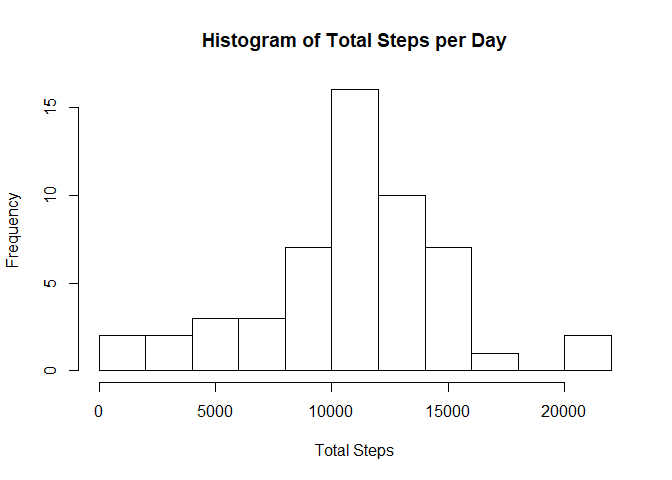

## Loading and preprocessing the data

```r
unzip("activity.zip")
dat <- read.csv("activity.csv")
dat$date <- as.Date(dat$date)
#Display the complete number instead of scientific expression
options(scipen=999)
str(dat)
```

```
## 'data.frame':	17568 obs. of  3 variables:
##  $ steps   : int  NA NA NA NA NA NA NA NA NA NA ...
##  $ date    : Date, format: "2012-10-01" "2012-10-01" ...
##  $ interval: int  0 5 10 15 20 25 30 35 40 45 ...
```


## What is mean total number of steps taken per day?
1. Calculate the total number of steps taken per day

```r
totalSteps <- tapply(dat$steps, dat$date, sum)
```
2. Make a histogram of the total number of steps taken each day

```r
h <- hist(totalSteps, breaks = 10, xlab = "Total Steps",
          main = "Histogram of Total Steps per Day")
```

<!-- -->

3. Calculate and report the mean and median of the total number of steps taken per day

```r
meanSteps <- summary(totalSteps)["Mean"]
medianSteps <- summary(totalSteps)["Median"]
```
The mean and median of the total number of steps taken per day are 10766.1886792 and 10765, respectively.

## What is the average daily activity pattern?
1. Make a time series plot of the 5-minute interval (x-axis) and the average number of steps taken, averaged across all days (y-axis)

```r
meanSteps <- tapply(dat$steps, dat$interval, 
                    function(x) mean(x, na.rm = TRUE))
plot(unique(dat$interval), meanSteps, type = "l",
     xlab = "Interval", ylab = "Mean steps")
```

<!-- -->

2. Which 5-minute interval, on average across all the days in the dataset, contains the maximum number of steps

```r
i <- names(which.max(meanSteps))
```
The 5-minute interval that contains the maximum number of steps is 835

## Imputing missing values
1. Calculate and report the total number of missing values in the dataset (i.e. the total number of rows with \color{red}{\verb|NA|}NAs)

```r
t <- sum(is.na(dat$steps))
```
The total number of missing values in the dataset is 2304.

2. Devise a strategy for filling in all of the missing values in the dataset. The strategy does not need to be sophisticated. For example, you could use the mean/median for that day, or the mean for that 5-minute interval, etc.  
**The strategy is to replace NA values by the average of interval:**

```r
replaceNA <- function(x){
    IntervalMean <- tapply(x$steps, x$interval,
                           function(y) mean(y, na.rm = TRUE))
    #A logical array marking NA rows
    l <- is.na(x$steps) 
    #'interval' array that has NA 'steps' values
    li <- x$interval[l] 
    #average 'interval' values
    ai <- sapply(li, function(z) IntervalMean[c(as.character(z))]) 
    #Replace NA 'step' values by average 'interval' values
    x$steps[l] <- ai
    x$steps
}
```

3. Create a new dataset that is equal to the original dataset but with the missing data filled in.

```r
dat1 <- dat
dat1$steps <- replaceNA(dat)
str(dat1)
```

```
## 'data.frame':	17568 obs. of  3 variables:
##  $ steps   : num  1.717 0.3396 0.1321 0.1509 0.0755 ...
##  $ date    : Date, format: "2012-10-01" "2012-10-01" ...
##  $ interval: int  0 5 10 15 20 25 30 35 40 45 ...
```

4. Make a histogram of the total number of steps taken each day and Calculate and report the mean and median total number of steps taken per day. Do these values differ from the estimates from the first part of the assignment? What is the impact of imputing missing data on the estimates of the total daily number of steps?

```r
totalSteps <- tapply(dat1$steps, dat1$date, sum)
h <- hist(totalSteps, breaks = 10, xlab = "Total Steps",
          main = "Histogram of Total Steps per Day")
```

<!-- -->

```r
meanSteps <- summary(totalSteps)["Mean"]
medianSteps <- summary(totalSteps)["Median"]
```
After imputing, the mean and median of the total number of steps taken per day are 10766.1886792 and 10766.1886792, respectively.
Before imputing, the mean and median are 10766.1886792 and 10765, respectively. The mean did not change. And the median changed by 1.1%.

## Are there differences in activity patterns between weekdays and weekends?
1. Create a new factor variable in the dataset with two levels – “weekday” and “weekend” indicating whether a given date is a weekday or weekend day.

```r
library(chron)
n <- is.weekend(dat1$date)
day.f <- factor(n, labels = c("weekday", "weekend"))
summary(day.f)
```

```
## weekday weekend 
##   12960    4608
```
2. Make a panel plot containing a time series plot of the 5-minute interval (x-axis) and the average number of steps taken, averaged across all weekday days or weekend days (y-axis). See the README file in the GitHub repository to see an example of what this plot should look like using simulated data.

```r
dat1$date <- day.f
dat1Weekday <- dat1[dat1$date == "weekday", ]
dat1Weekend <- dat1[dat1$date == "weekend", ]
meanSteps1 <- as.data.frame(
    tapply(dat1Weekday$steps, dat1Weekday$interval, mean))
names(meanSteps1) <- "steps"
meanSteps1$dtype <- "weekday"
meanSteps1$interval <- unique(dat1$interval)
meanSteps2 <- as.data.frame(
    tapply(dat1Weekend$steps, dat1Weekend$interval, mean))
names(meanSteps2) <- "steps"
meanSteps2$dtype <- "weekend"
meanSteps2$interval <- unique(dat1$interval)
meanAll <- rbind(meanSteps1, meanSteps2)

day.nf <- as.factor(meanAll$dtype)
library(lattice)
xyplot(meanAll$steps~meanAll$interval|day.nf, type = "l",
   xlab = "Interval",
   ylab = "Number of steps",
   layout=c(1,2))
```

<!-- -->

